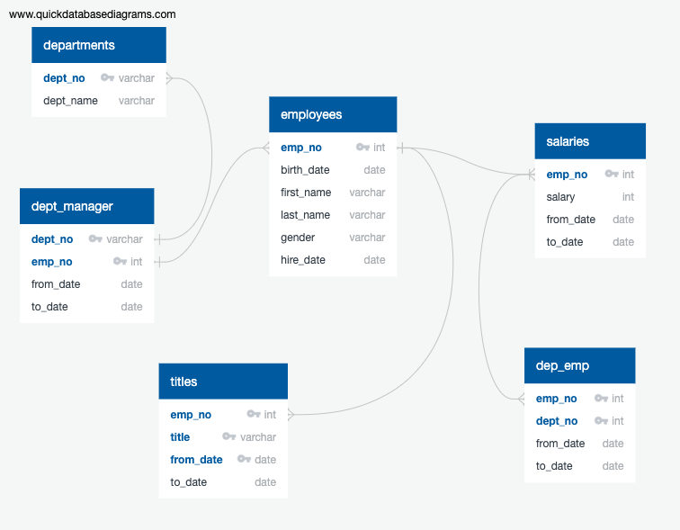
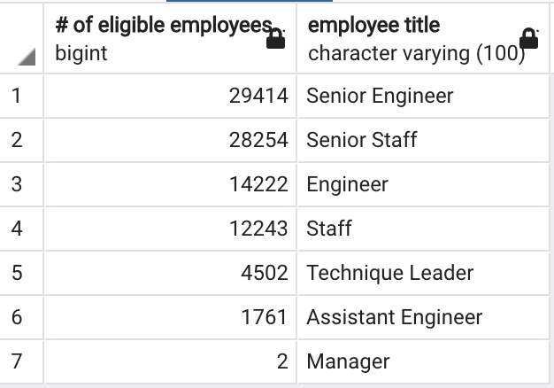
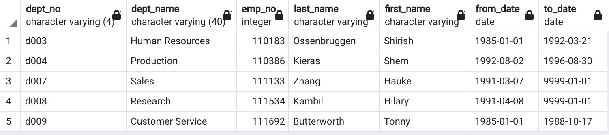

# Pewlett-Hackard-Analysis

Overview of the analysis: 

Bobby needed help to perform an analysis he was tasked with: future-proofing the company by determining how many people will be retiring and which employees will be eligible for a retirement package. To do this analysis, I created queries to provide when each employee was hired and their age.
Pewlett-Hackard is looking forward to create a mentorship to promote within company to alliviate the tsunami of retirement coming soon. 

To show the accurate picture among employee, manager, and departments information, I have created a logical diagram as visuals.

As I have analyzed who would be eligible for retirement based on hire and birth date by department, it became more clear what to focus on or take proactive steps for mentorship at the company. 
Below is the specifics.

Results: 

- Total number of retirment eligible employees is 90,398 who are born between January 1, 1952, and December 31, 1955.
- Percentage ready to retire is nearly 30% of all employees.
- There are 1549 employees eligible for mentorship to fill in potential retirees.

Summary: Provide high-level responses to the following questions, then provide two additional queries or tables that may provide more insight into the upcoming "silver tsunami."

Currently in the company database, there are five active managers as shown below. There is not enough qualified mentors to get ready for mentorship program.

